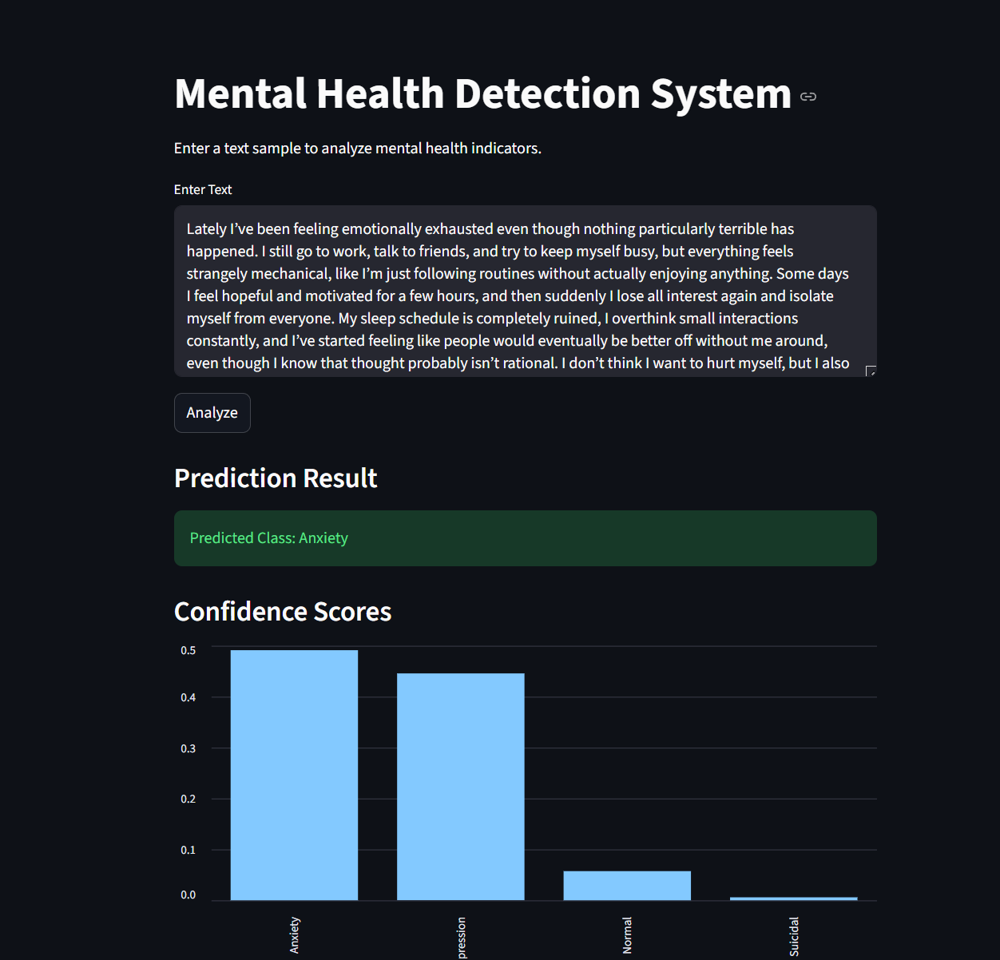

# Mental Health Risk Classification using NLP & Transformers

## Live Application


🌐 Deployed App:  
https://mental-health-risk-classification.onrender.com

---
# Project Overview

Mental health disorders such as depression, anxiety, and suicidal ideation have become increasingly common in today’s digital world. Many individuals express their emotions, struggles, and mental state through online posts, forums, and social media platforms. Early identification of mental health risks through Natural Language Processing (NLP) can help build supportive systems that assist healthcare professionals, communities, and individuals.

This project focuses on building an AI-powered Mental Health Risk Classification System capable of analyzing user-generated text and predicting whether the text indicates:

- Normal
- Depression
- Anxiety
- Suicidal tendencies

The system uses modern NLP techniques ranging from classical machine learning models to transformer-based deep learning architectures.

The final production model is built using **DistilBERT**, a lightweight transformer model that provides strong contextual understanding while remaining computationally efficient.

---

# Why Mental Health Detection Matters

Mental health issues are often difficult to identify early because emotional distress is frequently expressed subtly through language. Traditional keyword-based systems struggle to capture context, sarcasm, emotional nuance, and implicit meaning.

Transformer-based NLP systems can help:

- Detect early signs of emotional distress
- Understand contextual mental-health language
- Improve accessibility to support systems
- Assist in large-scale mental-health monitoring
- Enable AI-assisted mental-health research

This project aims to explore how modern NLP architectures can improve mental-health-related text classification tasks.

---

# Project Links

## Jupyter Notebook

📘 Notebook:  
[Project Notebook](./notebooks/mental_health_risk_classification.ipynb)

---

## Streamlit Application

🚀 Streamlit App:  
[streamlit_app.py](./app/streamlit_app.py)

---

## FastAPI Backend

⚡ FastAPI Backend:  
[api.py](./app/api.py)

---

# Dataset

Dataset used:

**Sentiment Analysis for Mental Health**

Source: Kaggle

The dataset contains text samples related to multiple mental health conditions. For this project, the following 4 classes were used:

| Label | Class |
|---|---|
| 0 | Normal |
| 1 | Depression |
| 2 | Anxiety |
| 3 | Suicidal |

---

# Project Workflow

The project was built phase-by-phase to simulate a real-world NLP engineering workflow.

---

# 1. Exploratory Data Analysis (EDA)

Performed extensive exploratory analysis to understand:

- Class distribution
- Dataset imbalance
- Text length distribution
- Token length distribution
- Duplicate and null values
- Data quality issues

### Key Findings

- Dataset contained approximately 45k samples
- Significant class imbalance existed
- Large variation in text lengths
- Long-tail text distributions required truncation strategies

These findings helped optimize transformer sequence length and training efficiency.

---

# 2. Data Preprocessing

Text preprocessing pipeline included:

- Lowercasing
- Removing special characters
- Cleaning noisy text
- Train-validation-test splitting
- Label encoding

Different tokenization strategies were used for:
- Classical ML models
- LSTM models
- Transformer models

---

# 3. Classical NLP Baseline Models

Initial baseline models were built using:

- TF-IDF Vectorization
- Logistic Regression
- Naive Bayes

### Purpose

- Establish performance baseline
- Understand limitations of lexical models

### Observations

Classical NLP models struggled with:
- Context understanding
- Semantic ambiguity
- Emotion overlap between classes

---

# 4. Deep Learning with LSTM

A deep learning pipeline using TensorFlow/Keras LSTM networks was implemented.

### Techniques Used

- Word embeddings
- Sequence padding
- Tokenization
- Sequential context modeling

### Results

LSTM significantly improved:
- Context understanding
- Semantic learning
- Minority class detection

However, limitations remained for:
- Long-range context
- Implicit emotional meaning

---

# 5. Transformer Fine-Tuning using DistilBERT

The final production model was built using:

- HuggingFace Transformers
- PyTorch
- DistilBERT

DistilBERT was selected because it provides:
- Strong contextual understanding
- Faster training
- Lower memory consumption
- Efficient inference performance

### Key Optimizations

- Sequence length optimization (`max_length = 256`)
- GPU acceleration
- Transformer fine-tuning
- Efficient tokenization
- Lightweight transformer architecture

---

# Final Model Performance

| Metric | Score |
|---|---|
| Accuracy | 84% |
| Macro F1 Score | 0.84 |

### Key Improvements

- Significant improvement over TF-IDF models
- Strong contextual understanding
- Better Anxiety and Suicidal detection
- Improved semantic interpretation

---

# Error Analysis

Advanced evaluation techniques were performed including:

- Confusion matrix analysis
- Confidence score analysis
- Misclassification analysis
- Semantic overlap analysis

### Major Observations

- Depression and Suicidal classes showed semantic overlap
- Anxiety detection improved significantly using transformers
- Transformer attention mechanisms improved contextual understanding

---

# Production Deployment

The project was transformed from a research notebook into a deployable AI application using:

- FastAPI backend
- Streamlit frontend
- Docker containerization

The deployed system supports:
- Real-time text inference
- Probability-based predictions
- Interactive web interface

---

# Application Architecture

```text
User Input
    ↓
Streamlit Frontend
    ↓
FastAPI Backend
    ↓
DistilBERT Inference Engine
    ↓
Prediction + Confidence Scores
```

---

# Local Project Setup Guide

Follow the steps below to run the project locally on your machine.

---

```bash
Clone Repo
```
```bash
cd Mental-Health-Risk-Classification
```
```bash
python3 -m venv venv
source venv/bin/activate
```
```bash
pip install -r requirements.txt
```
**Run Backend:**
```bash
uvicorn app.api:app --host 0.0.0.0 --port 8000
```
**Frontend:**
```bash
streamlit run app/streamlit_app.py
```


